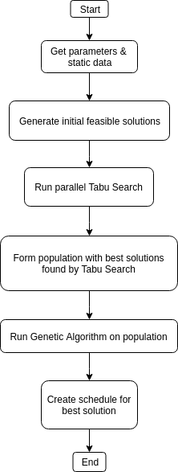

# Job Shop Schedule Problem

This problem was given to us by [Quad Graphics](https://www.quad.com/) in a mathematics course titled *Math 490: Preparation for Industrial Careers: Solving Industrial and Applied Problems in Teams* (sponsered by [PIC Math](https://www.maa.org/programs-and-communities/professional-development/pic-math)) during the Spring 2019 semester.

**Team:**  
[Matthew McFadden](https://github.com/mcfadd)  
[Jessica Wolfson](https://github.com/JFWolfson)  
[Maddie Kenney](https://github.com/MaddieKenney)  
[Anthony Valdez ]()  

## Problem Description

Given m machines with different run speeds and n jobs which have a varying number of tasks that need to be completed, create a program that schedules the tasks from all jobs on the machines such that the completion time (i.e. make span) is minimized.

**Additional Information**  
* Each Task has a set amount of pieces that needs to be processed for the task to be complete.
* The machines all have different run speeds.
* Certain tasks can be run in parallel on these machines.
* Each task has a sequence dependent setup time.
* If a task is the first to run on a machine there will be no setup time.

**Constrains**  
* On a machine, there can be no overlap in start and end times for any job task.
* Tasks within the same job cannot be started unless all other tasks within the same job with a sequence number less than the current task are complete.
* Each task can only be run on certain machines.
* The program must produce a schedule in 10 minutes or less.

**Data for a small instance of the problem**  
* [jobTasks.csv](https://github.com/mcfadd/Job_Shop_Schedule_Problem/blob/master/data/jobTasks.csv)
* [machineRunSpeed.csv](https://github.com/mcfadd/Job_Shop_Schedule_Problem/blob/master/data/machineRunSpeed.csv)
* [sequenceDependencyMatrix.csv](https://github.com/mcfadd/Job_Shop_Schedule_Problem/blob/master/data/sequenceDependencyMatrix.csv)

## Solution Formulation

We formulate a solution as a list of operations where and operation consists of JobId, taskId, sequence number, and machine for the task to run on. The order of the list determines the order in which the operations are scheduled.

For example, below is a feasible solution to a problem instance with 3 jobs, and 2 machine.  
Each row represents an operation in the form [jobId, taskId, sequence number, machine number].  

```python
[[0, 0, 0, 0],
 [0, 1, 1, 1],
 [1, 0, 0, 1],
 [2, 0, 0, 0],
 [1, 1, 1, 0]]
```

Here is an example of an infeasible solution:

```python
[[0, 1, 1, 0],
 [0, 0, 0, 0],
 [1, 0, 0, 1],
 [2, 0, 0, 0],
 [1, 1, 1, 0]]
```

The solution is infeasible because job 0, task 1 with sequence = 1 is scheduled on machine 0 before job 0, task 0 with sequence = 0.

To calulate the make span of a feasible solution we calculate the max of (total run time + total wait time + total setup time) for each machine, where

* run time = task pieces / machine speed
* wait time = time a machine has to wait for a task with sequence < current task's sequence to be processed 
* setup time = set up time before processing the current task


To produce a schedule for each machine given a feasible solution, we iterate over the solution and add each Job-Task to a queue for the machine specified in the operation.

## Program Design

Below is a basic high-level flow digram describing our design.

  


