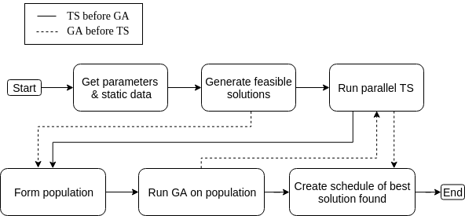
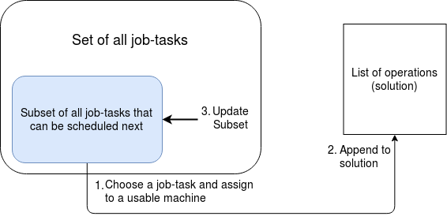
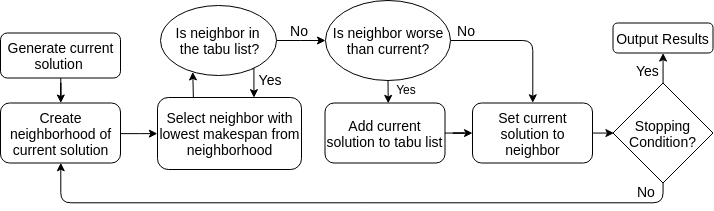
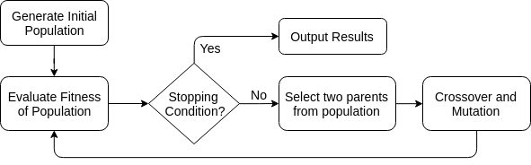

Algorithms
==========

Below is a high level flow diagram of the main sequence of steps to use both parallel tabu search and the genetic algorithm to find a solution to an instance of a job shop schedule problem.

Generate Feasible Solution
--------------------------

This algorithm generates a random feasible solution. It begins with an empty solution and a subset of all the job-tasks that can be scheduled next.
That is, initially the subset contains all the tasks with sequence number = 0. While the subset is not empty, tasks are removed at random and turned
into operations by assigning a usable machine (step 1), then they are appended to the solution (step 2). If there does not exist a task in the subset
that is apart of the same job as the task that was removed, then tasks from the same job with the next sequence number are added to the subset (step 3).
As operations are appended to the solution, tasks are added to the subset until all job-tasks have been appended to the solution.

Tabu Search
-----------

For general information on Tabu Search see `https://en.wikipedia.org/wiki/Tabu_search`_.

Tabu Search (TS), is a local search technique that begins with an initial candidate solution and iteratively updates the current solution by choosing
anew solution from the current one’s neighborhood. Neighbors of the current solution are generated by removing and replacing a randomly selected operation
at a different location. Infeasible neighboring solutions are prevented by establishing lower and upper bounds on the replacement location such that an operation
will never be placed before an operation with the same job ID and lower sequence number, or after one with the same job ID and higher sequence number.
After a neighborhood is generated, the neighbor with the lowest makespan that is not in the tabu list is selected to become the new current solution.
If multiple neighbors tie for lowest makespan, a decision is made based on individual machine makespans.

Tabu search operates on the principle of steepest ascent/mildest descent, meaning the best available solution in the neighborhood is always chosen, and if none
are better than the current solution, the best of the worse solutions is chosen. The key feature of TS is the tabu list. When a move to a worse or equal solution is made,
the current solution is added to the tabu list (i.e. made tabu), forcing the algorithm to not simply cycle back to the previous better solution.

To better help avoid entrapment in local minima, we added a forced-descent feature. If the best solution found has not improved after a certain number of
iterations (called *reset_threshold*), a move to a worse solution is forced. The move is not necessarily one of mildest descent, but rather to a neighbor randomly
selected from a set excluding those equal to or better than the current solution.

At termination, TS may generate a single best-found solution, or a set of multiple best-found solutions.

Genetic Algorithm
-----------------

For general information on Genetic Algorithm see `https://en.wikipedia.org/wiki/Genetic_algorithm`_.

Genetic Algorithms (GA) are modeled after the processes of natural selection and genetic recombination. A solution is analogous to an individual
organism with all its necessary information encoded in a single chromosome. Much like the ACTG scheme of real DNA, the chromosome consists of a sequence
of symbols from a predetermined alphabet.

Unlike tabu search, genetic algorithms work with a population of solutions. Parent solutions are chosen by some selection mechanism, and offsprings are
produced by combining parent chromosomes. Many methods of genetic recombination are possible, but the most common are crossover and mutation.

In crossover, a random selection of genes in one parent’s chromosome are chosen, then the other parent’s genes that are not in the selection of genes from
the first parent are combined in such a way to create a new offspring chromosome (child). The crossover operation avoids generating infeasible solutions by
first placing one parent’s selection of genes (i.e. contiguous block of operations) in a child solution. Then, it iterates through each operation (row) of the
other parent, placing each non-duplicate operation in either a top list or bottom list. Operations are then filled in around the child solution’s crossover block
according to the top list and bottom list.

Mutation may take place if the criteria is met (mutation probability).
Mutation involves changing the machine that a randomly chosen job-task runs on.

.. _`https://en.wikipedia.org/wiki/Genetic_algorithm`: https://en.wikipedia.org/wiki/Genetic_algorithm
.. _Generate Random Solution: https://github.com/mcfadd/Job_Shop_Schedule_Problem/wiki/Algorithms#generate-random-solution
.. _Compute Makespan: https://github.com/mcfadd/Job_Shop_Schedule_Problem/wiki/Algorithms#compute-makespan
.. _Tabu Search: https://github.com/mcfadd/Job_Shop_Schedule_Problem/wiki/Algorithms#tabu-search
.. _Genetic Algorithm: https://github.com/mcfadd/Job_Shop_Schedule_Problem/wiki/Algorithms#genetic-algorithm
.. _`https://en.wikipedia.org/wiki/Tabu_search`: https://en.wikipedia.org/wiki/Tabu_search

.. |br| raw:: html

   
